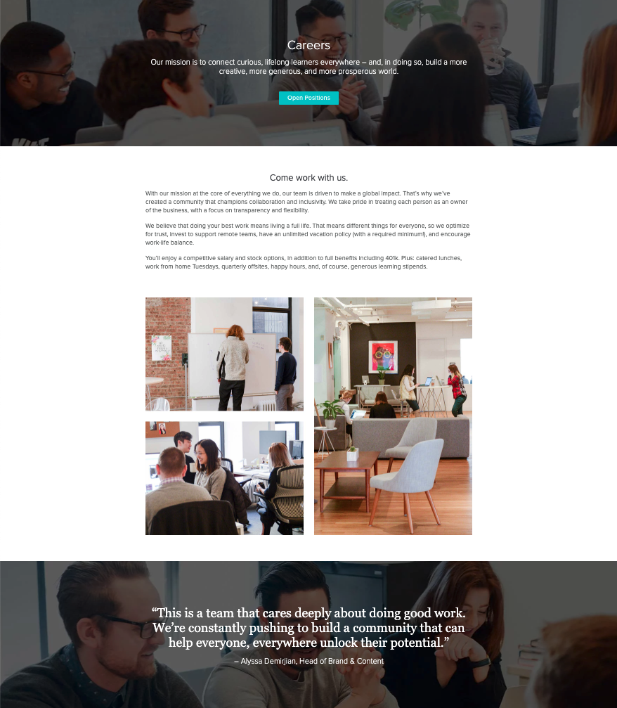

# UI Engineer Technical Interview
## Goal  

Create a delightful careers page that summarizes life at Skillshare and links to our job postings. You may ignore the current header and footer data, focusing purely on the careers page main content. You may use any images or icons to create this page. Please be creative and polished in your approach. We suggest you take 2hrs to complete this task. 

## Required Text and Links:
* ### Mission statement:  
>“Our Mission is to connect curious lifelong learners everywhere -- and, in doing so, build a more creative, more generous, and more prosperous world.”
* ### A link to open the position website:  
<https://jobs.lever.co/skillshare>

* ### What it’s like to work at Skillshare:  
>
"With our mission at the core of everything we do, our team is driven to make a global impact. That’s why we’ve created a community that champions collaboration and inclusivity. We take pride in treating each person as an owner of the business, with a focus on transparency and flexibility."

>
"We believe that doing your best work means living a full life. That means different things for everyone, so we optimize for trust, invest to support remote teams, have an unlimited vacation policy (with a required minimum!), and encourage work-life balance."

>
"You’ll enjoy a competitive salary and stock options, in addition to full benefits including 401k. Plus: catered lunches, work from home Tuesdays, quarterly offsites, happy hours, and, of course, generous learning stipends."

* ### Employee quote:  
>
“This is a team that cares deeply about doing good work. We’re constantly pushing to build a community that can help everyone, everywhere unlock their potential.” - Alyssa Demirjian, Head of Brand & Content 

## Potential Resources:
### Images
* <https://unsplash.com/>
* <https://pixabay.com/>
* <https://burst.shopify.com/>

### Icons
* <https://www.flaticon.com/>
* <https://icons8.com/icons>
* <https://www.vecteezy.com/free-vector/icons>

## Current State:
